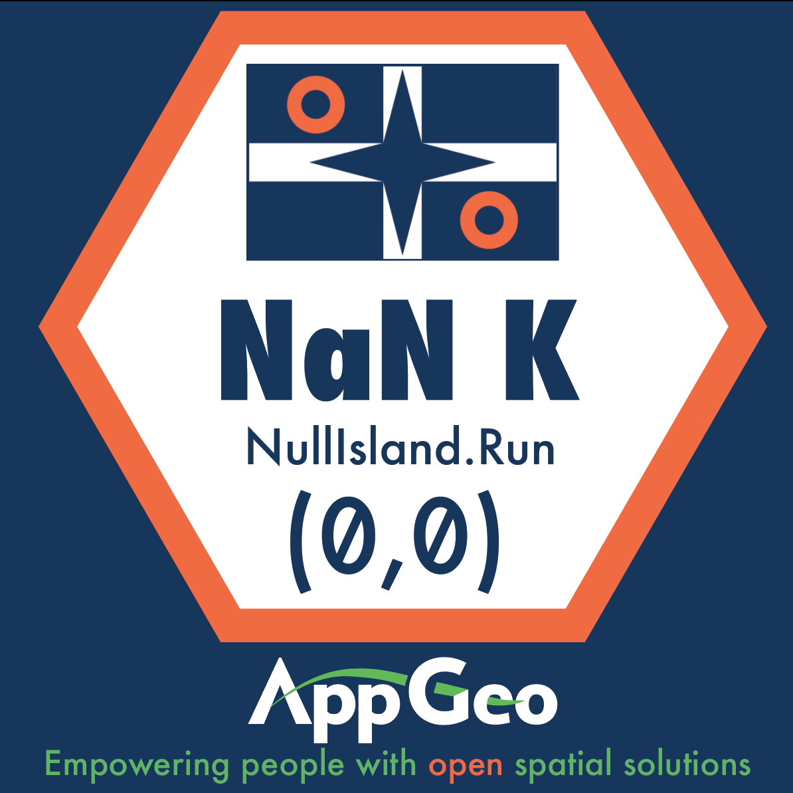

# Welcome

Welcome to the **Null Island NaN K Run**. This classic run features a scenic NaN kilometer course around Null Island and supports all the individuals who champion Open Source Geospatial around the world. We welcome all to join us in this incredible run.

Join in the fun by sharing a photo of your office or home workspace with your current Open Source Geospatial project, your location, and the hashtag **[#NINaNK](https://twitter.com/intent/tweet?button_hashtag=NINaNK&ref_src=twsrc%5Etfw)** on twitter. 

Applied Geographics is thrilled to support this event. We want to promote the great people who make up the open source geospatial community around the world, even on Null Island. As members of this community we have benefited from the amazing open source projects and their contributors. The Null Island Run is a great way for us to give back by adding some fun to events everywhere.

If you are attending the [FOSS4G Dar es Salaam 2018](https://2018.foss4g.org/) conference keep a look out for [@Guidos](https://twitter.com/guidos) to get your NaN K participation sticker.

## FAQ

**What is Null Island?**  
There is a long and storied history to cartographic anomalies. In the past a map could contain areas with dragons symbolizing uncharted or rough areas. More recently you can find paper roads which have mysterious meaning.

Technology today still faces these types of anomalies. When location data is missing coordinate information they fall onto the mysterious Null Island. It is said to be located near the intersection of the equator and the prime meridian with the coordinates of (0,0). To find out more please [visit the Null Island wiki page](https://en.wikipedia.org/wiki/Null_Island "Null Island Wiki Page").

**How do you get to Null Island**  
The reccomended route to Null Island is to go to Kings Cross in London, go through platform 9 and 3/4, take the train to Hogwarts, borrow a dragon and then fly it to Null Island. Just open a map and look for areas marked "here lie dragons".

**What is NaN?**  
NaN is a term to describe results that are Not a Number in the Javascript programming language. It is what happens when you try to add apples with integers. For more information please [visit the NaN wiki page](https://en.wikipedia.org/wiki/NaN "NaN Wiki Page").

**How many kilometers is a NaN K?**  
NaN is Not a Number, so it could be apple kilometers in length or orange kilometers in length. We don’t really know, but if you figure it out let us know.

**How do I participate in the run?**  
You can participate in the “run” by sharing the following on twitter with the hashtag [#NINaNK](https://twitter.com/intent/tweet?button_hashtag=NINaNK&ref_src=twsrc%5Etfw):

- A photo of your workstation with your favorite open source geospatial tools on the screen. You can decide to be in the photo or not, it is up to you.
- Your location (e.g. town, state, province, country),  whatever you are comfortable sharing online.

**How does one train for this run?**  
We recommend reading [Eloquent Javascript](https://eloquentjavascript.net/), drinking water, breathing air, and stretching. You really are training to have fun, so whatever works best for you.

**Will there be porta-potties, snacks, or gift bags?**  
There will be no porta-potties, snacks, or gift bags. Heck, there will be no race course, volunteers, start or finish line either. Participation stickers will be available at conferences when a run representative is present. 

**When is this happening?**  
It depends on where you live, the angle of the sun and stars, what your twitter situation is, and how much fun you want to have. Feel free to take a photo of your workstation whenever you like and share it on twitter for all to see with the hashtag [#NINaNK](https://twitter.com/intent/tweet?button_hashtag=NINaNK&ref_src=twsrc%5Etfw).

**How long will it take to run the NaN K?**  
Running a NaN K will take less time than reading this sentence no matter what your current minute mile PR is.

## Tweets

<a class="twitter-grid" data-partner="tweetdeck" href="https://twitter.com/AppGeo/timelines/1032277089993596928?ref_src=twsrc%5Etfw">Null Island NaN K</a> 

